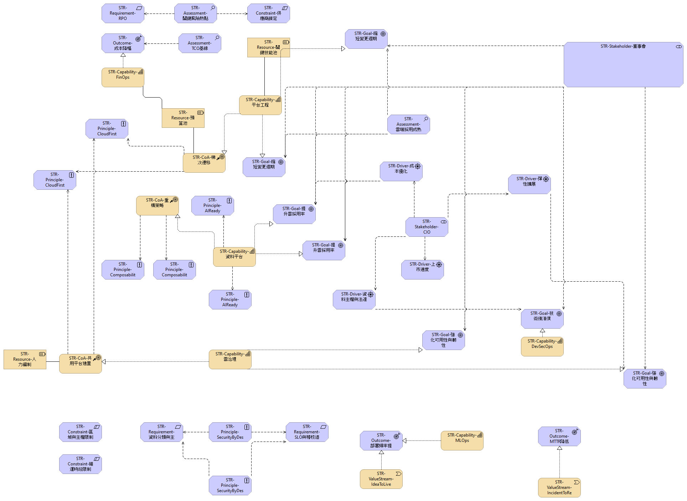

# 策略與動機 (Strategy & Motivation)

雲端採用的背後有明確的策略與動機。企業希望透過雲端提升敏捷度、加速產品上市並支援數位轉型。本章節說明主要的推動力：

- **商業敏捷度**：雲端服務讓企業能快速試驗並擴展新方案，應對不斷變化的市場需求。
- **成本與投資效益**：採用按需付費模式降低前期資本支出，並透過自動化與最佳化減少長期運營成本。
- **創新與競爭優勢**：雲端平台提供豐富的服務與技術生態系，支援 AI、分析與物聯網等創新功能。

此視圖對應於模型中的「Strategy&Movitation」視圖，為後續章節奠定基礎。
