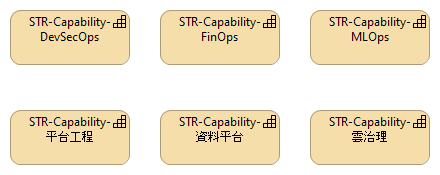

# 02. Capability Map

## 視圖概述
定義企業為達成戰略目標所需具備的核心能力。每個能力都標註了 KPI 與成熟度，作為投資與改善的依據。

## 核心能力與 KPI
| 能力名稱 | 擁有者 | KPI 指標 |
| :--- | :--- | :--- |
| **雲端治理** | CIO | 1. 政策合規率 > 95% 2. [cite_start]違規資源自動修復率 > 80% [cite: 1] |
| **平台工程** | 平台工程部 | 1. R&D 部署前置時間 < 4 小時 2. [cite_start]部署頻率: 每天 2 次 [cite: 2] |
| **FinOps** | FinOps 分析師 | [cite_start]雲端閒置資源成本佔比 < 10% [cite: 3] |
| **DevSecOps** | CISO | [cite_start]高風險漏洞修復時間 (MTTR) < 24 小時 [cite: 4] |
| **資料平台** | 資料長 (CDO) | 1. 資料品質分數 > 90% 2. [cite_start]資料攝取延遲 < 15 分鐘 [cite: 5] |
| **MLOps** | AI 團隊負責人 | [cite_start]模型訓練到上線 < 2 天 [cite: 6] |

