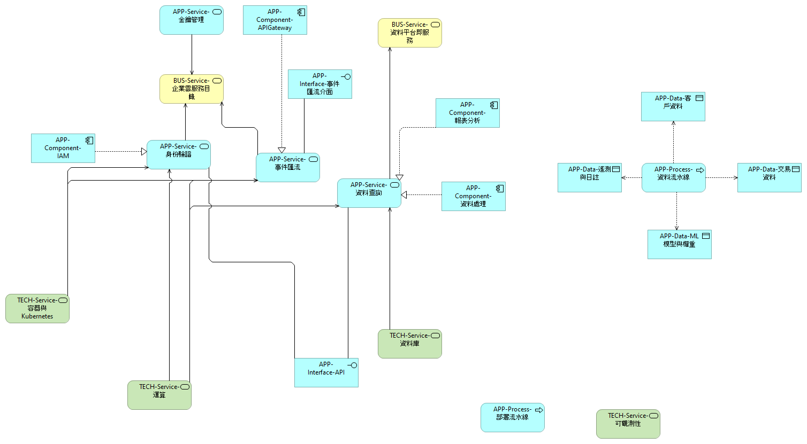

# 服務地圖：業務、應用與技術 (Service Map: Business–App–Tech)

服務地圖展示從業務流程到應用與技術層的串聯關係。透過將服務分層，企業能掌握每一層在雲端轉型中的角色與影響：

- **業務服務**：描述面向客戶或內部的核心業務功能，例如銷售、客戶管理或財務服務。
- **應用服務**：實現業務服務所需的應用元件，例如 CRM 系統、分析平台或自訂應用。
- **技術服務**：支撐應用服務運行的基礎設施與平台服務，如資料庫、容器平台、網路與安全機制。

此視圖對應於模型中的「Service Map-Business-App-Tech」視圖，幫助利害關係人了解價值鏈如何落實到技術堆疊。
