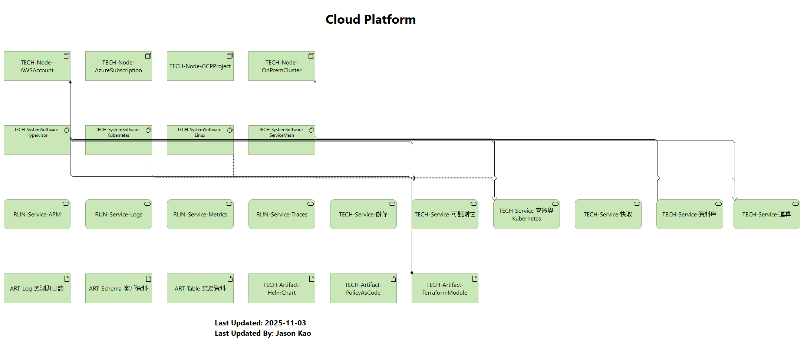

# 雲端平台 (Cloud Platform)

本章節說明雲端平台的組成元素，以及支撐企業運行的技術堆疊。雲端平台主要包括：

- **計算層**：虛擬機、容器、無伺服器運算等，提供彈性擴展的計算能力。
- **儲存與資料管理**：物件儲存、區塊儲存與資料庫服務，用於存放企業數據並確保可擴展性與高可用性。
- **網路與連接**：虛擬私有雲、負載平衡、DNS 與內容傳遞網路，提供安全且高效的連接。
- **開發與部署平台**：CI/CD 管線、容器平台與服務網格，支援快速部署與一致管理。

此視圖對應於模型中的「Cloud Platform」視圖，概述雲端平台各層的關聯與功能。
