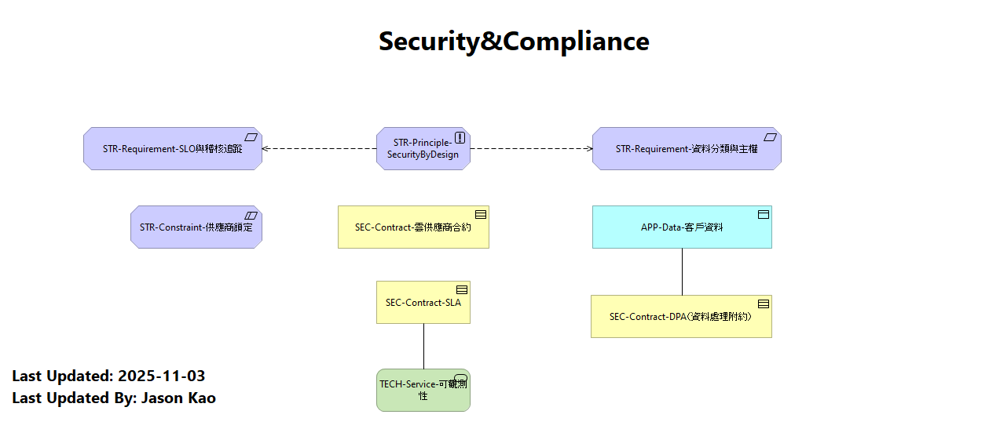

# 安全與合規 (Security & Compliance)

雲端環境的安全與合規性至關重要。本章節概述確保安全與遵循規範的措施：

- **身分與存取管理**：實施單一登入、多因素驗證與零信任架構，確保適當的人能在適當的時間取得適當的資源。
- **資料保護**：利用加密、備份與敏感資料標記，防止資料外洩或遺失。
- **威脅監測與回應**：部署安全事件監控、入侵偵測與自動化回應流程，快速識別並處理安全事件。
- **合規與審計**：遵循如 GDPR、ISO 27001 等法規與標準，並持續進行稽核與報告。

此視圖對應於模型中的「Security & Compliance」視圖，強調在雲端環境中維護信任與合規的關鍵要素。
