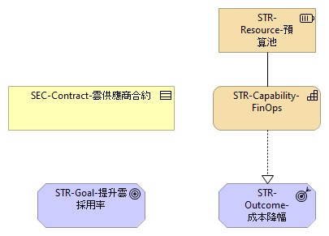

# FinOps

FinOps（Finance + DevOps）是一種跨部門協作模式，透過持續監控與最佳化雲端支出來提升財務透明度。本章節介紹 FinOps 的核心活動：

- **成本透明與預算**：建立清晰的成本中心與標籤，定期生成成本報告以促進預算管理。
- **持續最佳化**：分析使用狀況，採用儲值折扣、預留容量與關閉閒置資源等措施以降低費用。
- **共享責任模式**：將財務管理責任從單一部門擴展到開發、運營與商業團隊，確保對成本的共同認知。

此視圖對應於模型中的「Finops」視圖，強調雲端成本管理與效率提升的重要性。
