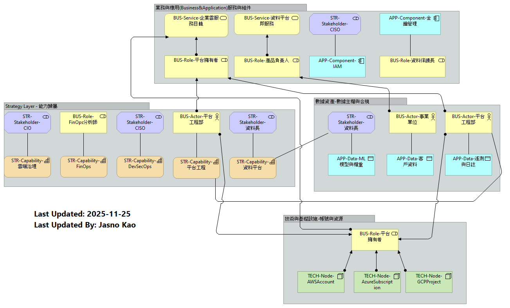

# 雲端治理與權責歸屬 (Governance & Ownership)

在雲端環境中，責任歸屬（Accountability）與績效衡量（Measurement）是卓越維運的主要關鍵。本章節探討雲端各種組件的R&R：

- **戰略層(Strategy Layer)-能力歸屬**：推動雲轉型的核心能力，建議由高層利害關係人或特定職能主管負責。
- **業務與應用層(Business & Application)-服務與組件**：針對具體的服務與應用組件，採用「產品導向」思維，指定產品負責人。
- **數據層(Data Assets)-數據主權與合規**：資料是一個組織最敏感的部分，必須區分「業務擁有者」與「合規監管者」。
- **技術與基礎設施層(Technology Layer)-帳號與資源**：建雲端帳號與資源是產生費用的實體，需綁定付費責任人。

此視圖對應於模型中的「Governance&Ownership」視圖，幫助企業在雲端上確認負責與當責。