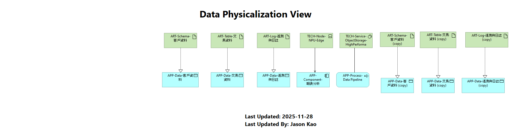

# 15. Data Physicalization View

## 視圖概述
架構中最底層的數據視圖。將邏輯上的數據物件映射到具體的物理實作，確保數據治理落地。

## 映射關係
* **邏輯層 (Logical)**:
    * [cite_start]客戶資料, 交易資料 [cite: 15]。
    * [cite_start]遙測與日誌 [cite: 16]。
* **物理層 (Physical)**:
    * [cite_start]`ART-Schema-客戶資料` (資料庫 Schema) [cite: 27]。
    * [cite_start]`ART-Table-交易資料` (資料庫 Table) [cite: 28]。
    * [cite_start]`ART-Log-遙測與日誌` (實體日誌檔) [cite: 28]。

